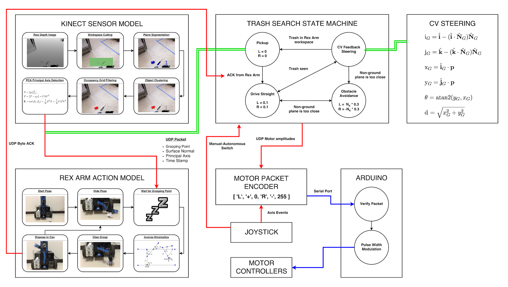

# Trashbot

All testing is done on Ubuntu 14.04 LTS, and the dependency install scripts all make this assumption.

This project is split into separate modules:
* Kinect sensor model
* Rexarm controller
* MagicBot motion controller
* Joystick

each of which runs on its own process. To build any of these executables, perform
the following steps.

## Steps to build:

1. `cd <module>`
2. `install_deps.sh`
3. `make`

For the newly built modules to link with shared libraries, you must run `source set_release_ld_path.sh` in each new shell at the root of the source tree. (Use
`set_debug_ld_path.sh` to link with the debug build of OpenNI2. This solves a
segfault in libOniFile.so).
