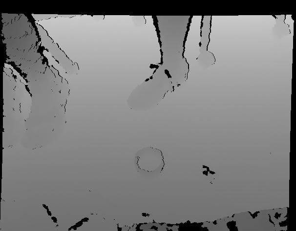
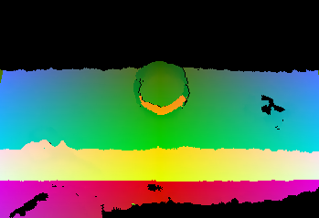
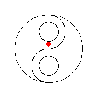
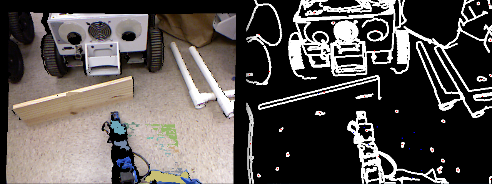
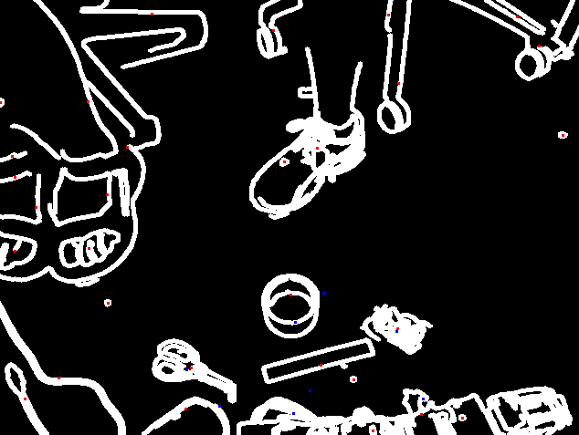
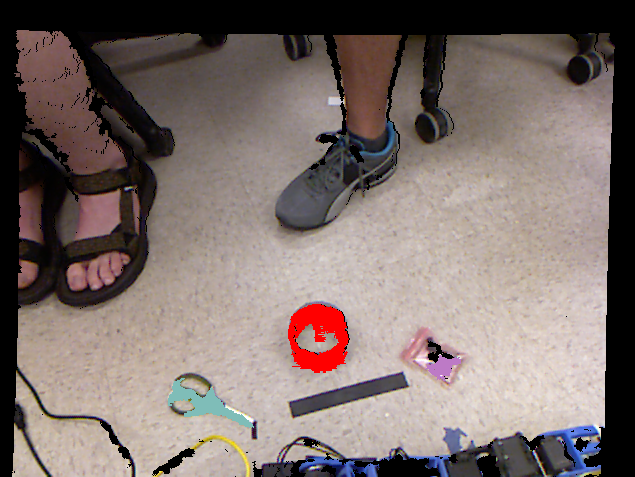

## Kinect Subsystem Progress Tracker
##### Prototype 1 (complete):
- Ubuntu 14.04 fresh install with dependency installation scripts:
    - libfreenect
    - OpenNI2
    - OpenCV
    - Point Cloud Library (PCL)
- Joystick event processing
- UDP socket inter-process communication
- Recording video streams to lossless files
- Video stream file playback
- Depth thresholding
- Region filling
- Depth pixel -> world coordinates

##### Prototype 2 (complete):
- Velcro-mounted Kinect to the MagicBot wooden platform
- Rexarm 2D convex workspace culling
- Normal estimation
- Plane segmentation and filtering
- Point clustering into objects
- Simple object selection (closest)
- Object centroid as grasping point
- Grasping point and surface normal sent to Rexarm over UDP

##### Prototype 3 (complete):
- Parameter fine-tuning
- Rexarm 3D workspace box culling
- Occupancy grid for filtering transient objects
- Final object clustering

##### Final Demo (complete):
- Object ellipsoid fitting
- Enclosure boundary detection
- Long-distance object detection and routing IPC
- Roomba state machine
- Handle manual-autonomous switch button events

## Kinect Subsystem In Depth Analysis
### Minimum Viable Product
At a minimum, the TrashBot must be capable of autonomously picking up an object within reach when commanded over a remote input device. A human controller will be required to drive the robot within range of an object. To this end, the Kinect subsystem must be capable of responding to signals from the human controller, subsequently recognizing novel objects within reach of the Rexarm, as well as differentiating those objects and computing the world coordinates of a point at which the Rexarm can grasp an object.
### Prototype 1: Sensing
##### Kinect libraries
The Kinect is most often used with the Robot Operating System (ROS), which provides additional layers of abstraction over data streams produced by the Kinect. However, ROS is a large software distribution, with many additional features that we do not need for working with the Kinect. At a minimum, one must install libfreenect to interface with the Kinect on Linux. For this project, we found it most convenient to start with vanilla Ubuntu 14.04 then install libfreenect, OpenNI2, OpenCV, and Point Cloud Library (PCL). Libfreenect implements an OpenNI2 driver as a shared library, which we employ to work with an arguably higher-level interface. While OpenNI2 and libfreenect have near equivalent functionality with respect to the video streams, OpenNI2 supports multiple other sensor devices, making code more generic. OpenCV is the workhorse that provides image processing, format conversion, and visualization functionality. Point Cloud Library implements several important algorithms that will prove to be useful for object recognition. Our code repository provides dependency installation scripts which are tested on Ubuntu 14.04.
##### RGBD image registration
The Kinect provides both 16-bit depth image and 24-bit RGB image streams at 30 Hz. However, because of the location of the IR sensor relative to the camera, these images are not aligned. The process of aligning these images is referred to as image registration. Lucky for us, OpenNI2 provides this functionality as a `Device` option:
```cpp
// This ensures that depth and RGB streams are aligned with same resolution.
if (device.isImageRegistrationModeSupported(
        IMAGE_REGISTRATION_DEPTH_TO_COLOR))
{
    device.setImageRegistrationMode(IMAGE_REGISTRATION_DEPTH_TO_COLOR);
}
```


The algorithm for camera registration is also known as camera calibration. It involves estimating a homography, which is the map between the pixel space of each camera, using multiple correspondences of feature points in images of a scene taken by both cameras. Registration can also be accomplished if the intrinsic (focal length, focal point, image sensor) and extrinsic (direct isometry) parameters of the cameras are known, allowing one to construct the camera matrices.
##### Recording and playing back video streams
OpenNI2 also provides an immensely convenient class called the `Recorder`. Once `VideoStream`s are created for the Kinect, one may attach those streams to a `Recorder`, which saves the streams to a lossless video format.
```cpp
Recorder recorder;
if (record_streams) {
    recorder.create("./rgbd_stream.ONI");
    recorder.attach(color_stream);
    recorder.attach(depth_stream);
    recorder.start();
}
```
The `ONI` format can be opened as a file-backed streaming `Device` that behaves almost identically to the real Kinect `Device`. There is also a `PlaybackControl` class, which lets you choose a playback speed or even manually seek through the stream to any point in time (while keeping depth and RGB streams synchronized). This functionality comes in handy when you do not have immediate access to the Kinect device for testing. The majority of our computer vision algorithm testing was done using `ONI` files.

##### Converting depth pixels to world coordinates
In principal, given the vertical and horizontal field of view of the Kinect camera, one can convert any pixel coordinate into a point in 3D camera space. Using isosceles trigonometry, the image dimensions and field of view angles can be used to calculate the camera origin. By casting a ray from the camera origin through a pixel, eventually an object is reached at a given depth. A depth pixel is just a regular pixel of an image, but its value is a 16-bit unsigned integer, representing the perpendicular distance of the aforementioned object to the camera frame in millimeters. OpenNI2 does this conversion as follows:
```cpp
PointXYZ pt;
Point2i px;
Mat depth_mat;
CoordinateConverter::convertDepthToWorld(
    depth_stream,
    px.x, px.y, depth_mat.at<uint16_t>(px),
    &pt.x, &pt.y, &pt.z);
```


##### Responding to control signals
When the human controller signals the Kinect process with a `PickupCommand`, the process will begin sampling the video streams and searching for objects and grasping points. These signals are sent over Unix domain datagram sockets (UDP). Since all processes in our system run on the same laptop, we do not need to worry about packet loss; streaming sockets are overly complicated for this use case. While inside the main loop of the Kinect process, this check is performed:
```cpp
PickupCommand cmd;
socklen_t len = sizeof(js_addr);
ssize_t bytes_read = 1;
bool do_search = false;
while (bytes_read > 0) {
    bytes_read = recvfrom(
        sock, &cmd, sizeof(cmd), 0,
        (sockaddr*)&js_addr, &len);
    if (bytes_read < 0) {
        perror("recvfrom");
        exit(1);
    } else if (bytes_read != sizeof(cmd)) {
        continue;
    }
    // Consume all commands and only do a single search.
    do_search = true;
}
```
### Prototype 2: Objects and Integration
##### 2D convex workspace culling
Converting a 640x480 depth image to a point cloud is a significantly expensive operation (0.13 seconds) for a real-time application. Thus, we try to crop the image to a smaller region of interest (ROI). This ROI corresponds to the bounding box of the Rexarm workspace. By converting the corners of this box to pixel space, we can take the smallest box containing those corners as the ROI. Within this region, we also do depth thresholding that corresponds to the near and far z planes of the Rexarm workspace. This removes many pixels corresponding to rays that pass through the workspace without intersecting any objects.

##### Region filling with breadth-first search
A useful algorithm in computer vision is connected component search. This is essentially the functionality of the "paint bucket" tool available in most image editing software. By seeding some pixel coordinate, this algorithm will perform a breadth-first search of edge-adjacent pixels (with branching order 4). The criteria for selecting a visited pixel can vary, but the core algorithm is always the same:
```cpp
template<typename T>
std::vector<cv::Point2i> flood_select(
    const cv::Mat& m,
    cv::Point2i seed,
    cv::Mat& visited)
{
    std::vector<cv::Point2i> component;
    std::queue<cv::Point2i> search_queue;
    search_queue.push(seed);
    visited.at<uint8_t>(seed) = 1;
    cv::Rect m_rect(cv::Point(), m.size());
    while (!search_queue.empty()) {
        cv::Point2i p = search_queue.front();
        search_queue.pop();
        component.push_back(p);
        // Spawn 4 neighbors.
        int dx = 1, dy = 0;
        for (int i = 0; i < 4; ++i) {
            cv::Point2i n(p.x+dx, p.y+dy);
            if (m_rect.contains(n) and
                !visited.at<uint8_t>(n) and
                m.at<T>(n) != 0)
            {
                search_queue.push(n);
                visited.at<uint8_t>(n) = 1;
            }
            std::swap(dx, dy);
            dx *= -1;
        }
    }
    return component;
}
```



This is used immediately after depth thresholding to select connected nonzero components of pixels, in hopes that they might be objects in the Rexarm workspace.
##### Normal estimation
One great thing about depth images is that they give grid structure to a point
cloud. This can make normal estimation much more efficient by employing the
knowledge about adjacent points. For any given point in the cloud, one may
simply check the adjacent pixels, use points to calculate surface tangent vectors,
and average their cross products. An unstructured point cloud does not support
this without first computing some other spatial data structure (KDTree). For more
details about this method, see [2].

Normals are estimated by PCL as follows.
```cpp
PointCloud<Normal>::Ptr estimate_normals(PointCloud<PointXYZ>::ConstPtr pc) {
    PointCloud<Normal>::Ptr normals(new PointCloud<Normal>);
    IntegralImageNormalEstimation<PointXYZ, Normal> ne;
    ne.setNormalEstimationMethod(ne.AVERAGE_3D_GRADIENT);
    ne.setMaxDepthChangeFactor(0.02f);
    ne.setNormalSmoothingSize(10.0f);
    ne.setInputCloud(pc);
    ne.compute(*normals);
    return normals;
}
```
##### Plane segmentation and filtering
The biggest assumption allowing the Kinect subsystem to detect objects is
that objects will always be resting on a planar surface. More precisely, we assume
$`O = W - P`$ where $`W`$ is the set of points in the workspace, $`P \subseteq W`$ is the set of large planar clusters, and $`O`$ is the set of points which may be
graspable objects.

Segmentation is performed by clustering normals with random sample and consensus
(RANSAC). The majority-voted plane cluster will be removed from the point cloud
on each iteration. When the planes become too small, sementation ends and
ideally only objects remain (we will see this is not a valid assumption). See [3] for more details.

PCL provides both `SACSegmentation` with `SACMODEL_PLANE` and
`OrganizedMultiPlaneSegmentation` structures for doing plane segmentation.

##### Object clustering
After segmentation, the remaining points are clustered into objects by simple
Euclidean distance. `idx_px_map` is used as an index array mapping from pixel
coordinates (as 1D index) to filtered point cloud index (since filtering and
clustering mutate the array ordering).
```cpp
// Cluster remaining points.
vector<PointIndices> cluster_idx;
search::KdTree<PointXYZ>::Ptr tree(new search::KdTree<PointXYZ>);
tree->setInputCloud(filt_pc);
EuclideanClusterExtraction<PointXYZ> ec;
ec.setClusterTolerance(cluster_tolerance);
ec.setMinClusterSize(min_region_size);
ec.setMaxClusterSize(25000);
ec.setSearchMethod(tree);
ec.setInputCloud(filt_pc);
ec.extract(cluster_idx);

// Convert clusters back into ROI-space pixel coordinates.
vector<vector<Point2i>> object_px;
for (const auto& cluster : cluster_idx) {
    vector<Point2i> px_coords;
    for (const auto& i : cluster.indices) {
        px_coords.push_back(Point2i(
            (*idx_px_map)[i] % roi.width, (*idx_px_map)[i] / roi.width));
    }
    object_px.push_back(px_coords);
}
```
##### Sending grasping points to the Rexarm
Although there is still work to be done filtering residual plane objects from
the clustering results, at the time of developing prototype 2, we considered it
important to send some kind of grasping point to the Rexarm. For now, we assume
that the objects under consideration have undergone filtering and refinement.

First, we must select an object for the arm to pick up. We simply choose the
object with the nearest depth, only sampling the medoid pixel from each object
as a heuristic. The medoid is calculated as the pixel in a region closest to
the centroid (mean pixel coordinate).
```cpp
// Choose the closest object to the Rexarm.
float min_dist = numeric_limits<float>::max();
int best_obj_idx = -1;
int j = 0;
for (const auto& object : final_objects) {
    auto px = region_medoid(object) - tl_px;
    PointXYZ pt = obj_info.cloud->at(px.x, px.y);
    float d = pt.x * pt.x + pt.y * pt.y + pt.z * pt.z;
    if (d < min_dist) {
        min_dist = d;
        best_obj_idx = j;
    }
    ++j;
}
```

Finally, the chosen object's medoid is sent as the grasping point, along with a
surface normal at that point.
```cpp
// Send grasping point to the Rexarm.
Point2i medoid = region_medoid(final_objects[best_obj_idx]);
medoid -= tl_px;
auto normal_cloud = estimate_normals(obj_info.cloud);
GraspingPoint gp;
gp.point = vec3f_from_pointxyz(
    obj_info.cloud->at(medoid.x, medoid.y));
gp.normal = vec3f_from_normal(
    normal_cloud->at(medoid.x, medoid.y));
gp.time_ms = depth_frame.getTimestamp();
sendto(
    sock,
    &gp,
    sizeof(gp),
    0,
    (sockaddr*)&rex_addr,
    sizeof(rex_addr));
```
##### Velcro MagicBot mount
One pesky detail to be aware of is that the Kinect IR sensor has a minimum range
of about one half meter. This necessitated that the Kinect be mounted from a
higher vantage point than the front of the MagicBot. Thus, we constructed our own
mount from 2x4s, hinges, screws, and velcro, which can be seen on the wiki homepage. The velcro strip allows us to adjust
the mount height. We also manually adjust the Kinect's base tilt up by three notches
from horizontal to keep the Rexarm out of the camera's view.

### Prototype 3: Filtering and robustness
##### 3D box workspace culling
One simple improvement we made that drastically improved results was to do
additional point cloud workspace culling. We kept all points in a rectangular
prismic region defined as the workspace. The points outside the box are culled.
##### Filtering transient objects
As noted earlier, plane segmentation does not give perfect results. We
want to be as stringent as possible about what constitutes a plane so we don't
filter out flat, graspable objects. This requires that we set a low distance
threshold for plane clustering. Because of noise in the depth image, noisy
planar regions may not be clustered, leaving transient residual planar objects.




To filter out these transients, we get some help from the RGB image. Here we make
the assumption that every graspable object will have edges in the RGB image
(after grayscale conversion). For this, we use the Canny edge detector and
perform morphological dilation to connect the edges into closed curves.
```cpp
// Make dilated edge image.
Mat gray_mat, edges;
cvtColor(color_mat, gray_mat, CV_BGR2GRAY);
blur(gray_mat, edges, Size(3,3));
Canny(edges, edges, 50, 150, 3);
int dilation_size = 2;
Mat element = getStructuringElement(
    MORPH_ELLIPSE,
    Size(2 * dilation_size + 1, 2 * dilation_size + 1),
    Point(dilation_size, dilation_size));
dilate(edges, edges, element);
vector<vector<Point2i>> edge_objects =
    find_nonzero_components<uint8_t>(edges);
```



With the "edge objects" extracted, we find the closest edge object to each
point cloud object by medoid Euclidean distance. For each closest edge object,
the point cloud objects are ranked by the percentage of edge pixels overlapping
the object. These percentages are also thresholded by a minimum 0.1.
```cpp
// Make object index image.
Mat obj_idx_img(
    height, width, CV_16U, Scalar(numeric_limits<uint16_t>::max()));
int i = 0;
for (const auto& obj : objects) {
    draw_pixels<uint16_t>(obj_idx_img, obj, i);
    ++i;
}

// Rank objects by closest edge overlap percentage.
const float min_pct = 0.1;
vector<float> best_pct_edge(edges.size(), min_pct);
vector<int> valid_obj_idx(edges.size(), -1);
int obj_idx = 0;
for (const auto& obj_med : object_medoids) {
    // Find closest edge.
    float min_dist = numeric_limits<float>::max();
    int j = 0;
    int edge_idx = -1;
    for (const auto& edge_med : edge_medoids) {
        float d = hypot(obj_med.x - edge_med.x, obj_med.y - edge_med.y);
        if (d < min_dist) {
            min_dist = d;
            edge_idx = j;
        }
        ++j;
    }

    // Calculate percentage of edge overlapped by object.
    int overlap = 0;
    for (const auto& px : edges[edge_idx]) {
        if (obj_idx_img.at<uint16_t>(px) == obj_idx) {
            ++overlap;
        }
    }
    float overlap_pct = float(overlap) / edges[edge_idx].size();

    // Take only the best percentage for each closest edge.
    if (overlap_pct > best_pct_edge[edge_idx]) {
        best_pct_edge[edge_idx] = overlap_pct;
        valid_obj_idx[edge_idx] = obj_idx;
    }

    ++obj_idx;
}
```

Only the `valid_obj_idx` point cloud objects are kept. The remaining objects
are used to update an 8-bit `OccupancyGrid` image with hit odds 20 and miss odds 5. After connected component search and closest object selection, the final results are shown below.



##### Parameter fine-tuning

It is crucial that parameters are carefully selected for the plane segmentation,
point cloud clustering, and occupancy grid. We achieve the best results by setting
the plane segmentation distance threshold to 2.5-3 millimeters, point cloud
clustering distance tolerance to 4.3 millimeters. The occupancy grid has several
parameters; we set miss odds to 5, hit odds to 20, and minimum edge overlap percentage
to 10%.

### Final Demo: Autonomy and improved grasping

##### Object ellipsoid fitting

After our first successful object pickup in prototype 3, we discovered that we
are making an improper assumption that will embarass our robot when performing in
front of an audience. While the arm can grasp spherical objects in any orientation,
the arm cannot always grasp eccentric objects, like a whiteboard eraser or any long box. This is because we do not yet have a behavior for the arm's wrist to turn and
grasp the object from different angles. If the object's principal axis is in the arm plane, then the claw will fail to enclose the long object.

To solve this problem, the Kinect subsystem will now do ellipsoid fitting for each
object it wishes to grasp. To explain precisely, we will form a zero-mean
data matrix $`X`$
consisting of points from the object point cloud as row vectors. We then compute
the singular value decomposition (SVD) of this matrix and take the eigenvector corresponding to the largest eigenvalue as the principal axis of the object.

This algorithm is known as principal components analysis. Note that the SVD
computation is indirectly finding the largest eigenvalue of the covariance matrix
$`\Sigma = \frac{1}{N}X^TX`$ for $`N`$ data points. We have $`X = U\Lambda V^T`$
for real unitary $`U,V`$, and thus $`N\Sigma = X^TX = V\Lambda^2 V^T`$. Thus we have a
diagonalization of $`\Sigma`$, and the first column of $`V`$ is the principal axis.

```cpp
Vector3f object_principal_axis(
    vector<Point2i> object_px, PointCloud<PointXYZ>::Ptr cloud)
{
    pcl::PCA<PointXYZ> pca(true);
    pca.setInputCloud(cloud);
    IndicesPtr indices = indices_from_px(object_px, cloud->width);
    pca.setIndices(indices);
    return pca.getEigenVectors().row(0);
}
```

For consistent results with point clouds, outlier points should be removed.

##### Enclosure boundary detection

In order to enhance our demo for the final showcase, we would like to implement
simple autonomous MagicBot navigation within an enclosure. Our algorithm is reminiscent of the Roomba; we will drive straight or random walk until an enclosure boundary or object is detected. This will be explained in further detail later.

In order to detect the enclosure boundary, you first need an enclosure boundary.
We considered using colored tape or wooden boards. The tape could be detected rather simply by looking for edges of that color in the Kinect RGB images. However, this would be susceptible to variance in the lighting of the environment. The boards have
several advantages: they are detected invariant of the lighting, they are easier to remove from the demo area, and they are simple
to detect using our existing plane segmentation algorithm. Ultimately, we are
using wooden boards for our enclosure.

Plane segmentation will be performed as usual, but we may use different parameters and also perform boundary plane detection. By modeling the inverse relationship of the plane area to its distance from the Kinect, we can dynamically choose the minimum plane area at which we end segmentation.

##### Roomba state machine

The Trashbot will navigate the enclosure while searching for trash. The simplest,
and yet effective, strategy for doing this is to either randomly wander or drive
straight until until an enclosure boundary or object is detected by the Kinect.

Once an object is detected, the motion controller will turn toward it until the
object is in the center of the occupancy grid then drive straight toward it. As the
Trashbot approaches the trash, the Kinect must provide feedback to steer the MagicBot. Upon reaching the trash, the Kinect will verify that the object is
reachable by the Rexarm and command it to perform the pickup.

Once a boundary is detected, the robot will turn until no boundaries are detected, then attempt to detect objects by turning in place and scanning for objects. If
no objects are found, the robot will begin wandering after putting itself on a trajectory away from the boundaries.

##### Long-distance object detection and routing IPC

In the wandering state, the Kinect will no longer crop the images to a region of interest, meaning the entire point cloud is computed. After extracting planes, we will
detect objects as usual, but with a much larger workspace.

In order to steer the robot toward the desired object, we must be able to track the object between frames and send continuous feedback to the motion controller over
UDP. This poses a new challenge for the inter-process communication aspect of our
project.

We will track objects by computing nearest object centroids between frames. The
UDP communication is simplified by the fact that we can assume a master-slave,
sender-receiver relationship between the Kinect process and the motion controller
process. Through sensing the environment, the Kinect generates all events by which state transitions are triggered, so we have a nice one-way stream. After each
iteration of the state machine, the Kinect process will send the motion controller
process a packet with information relevant to the state transitions and
steering.

##### Handle manual-autonomous switch button events

Our favorite choice for controlling the robot is to use a Playstation 3 controller
for manual control, while allowing the user to switch on Roomba mode with a button
press. This also gives us an effective killswitch for the autonomous mode if it escapes the enclosure.

To handle this use case, we invent a new event type to send the Kinect process
over UDP from the joystick process. The Kinect process will delegate this
command to the motion controller to effect its state.

#### References

[1] *Kinect Depth Sensor Evaluation for Computer Vision Applications.* M.R. Andersen, T. Jensen, P. Lisouski, et. al. Aarhus University. 2012.

[2] *Adaptive Neighborhood Selection for Real-Time Surface Normal Estimation from Organized Point Cloud Data Using Integral Images.* S. Holzer, R.B. Rusu, M. Dixon, et. al. IEEE/RSJ International Conference on Intelligent Robots and Systems. 2012.

[3] *Real-Time Plane Segmentation using RGB-D Cameras.* F. Steinbrucker, J. Sturm, D. Cremers. Department of Computer Science, Technical University of Munich, Germany. 2011.
